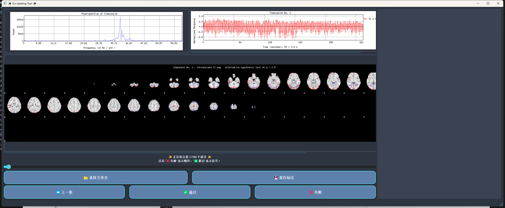

# fMRI Independent Components (ICs) Labeling Tool

Overview

The fMRI Independent Components (ICs) Labeling Tool is designed to help users label independent components from resting-state fMRI data, determining whether they are signals or noise. This labeling aids in the denoising process of fMRI data. The user-friendly interface allows efficient classification and saving of labeling results.

## Features

The tool includes the following main components:

- **Image Display Area**: Displays three images of the IC, including spatial images and associated time-series plots.
- **Slider**: Located below the images, allows for quick navigation between ICs.
- **Button Area**: Provides options to select a folder, save labels, navigate between images, and label ICs.
- **Label Results List**: Displays the labeled ICs and their status (Pass or Fail).

## Installation

To use the tool, follow these steps:

1. Clone this repository to your local environment:
    
    ```
    git clone <repository_url>
    Run ICs Labeling Tool.exe on Windows 
    
    ```
    

## Usage



### 1. Select Folder

- Click the **"📁 Select Folder"** button in the top left corner to choose a folder containing IC images.
- The selected folder should be the output folder generated by FSL's ICA decomposition tools, such as [MELODIC](https://fsl.fmrib.ox.ac.uk/fsl/fslwiki/MELODIC) or [ICA-AROMA](https://github.com/rhr-pruim/ICA-AROMA). This folder typically contains a subfolder named **"report"** that stores images for each IC. Each IC will have three types of images:
    - `f{index}.png`: Spatial image generated from the component, representing the brain's activation map.
    - `t{index}.png`: Time-series plot corresponding to the temporal dynamics of the component.
    - `IC_{index}_thresh.png`: Thresholded spatial map that highlights significant areas of activation within the component.

### 2. Browse Images


- After selecting a folder, images will be displayed in the three labels on the left side of the interface.
- Use the **"⏮️ Previous"** button or slide the **Slider** to navigate between ICs.
- The current IC index and progress (e.g., "Labeling IC 5/150") will be displayed above the images.

### 3. Label ICs

- Use the buttons below to label each IC:
    - **"✅ Pass"**: Click if the IC is a signal.
    - **"❌ Fail"**: Click if the IC is noise.
- Once labeled, the tool automatically moves to the next IC.

### 4. Save Label Results

- After labeling, click the **"💾 Save Labels"** button to save the results in the selected folder.
- Labels are saved as a **label.txt** file in JSON format.

### 5. View Label Results

- The labeled results will appear in the **Label Results List** on the right, showing the index and status (Pass or Fail) of each IC.

## Quick Operation Guide

- **Quick Navigation**: Use the slider to jump to a specific IC.
- **Image Zoom**: The image display area supports scrolling and zooming for detailed viewing.

## Status Bar

- The **Status Bar** at the bottom of the tool displays messages like successful label saving to keep you informed of the current operation status.

## Important Notes

1. **Image File Format**: Ensure the images are named and formatted correctly as per FSL's output, or they may not load properly.
2. **Maximum Number of Images**: The tool currently supports labeling up to 150 ICs.
3. **Saving Labels**: Always save your labels after completing the labeling process to avoid data loss.

## Troubleshooting

- **Images Not Loading**: Verify the folder path is correct and the images are named appropriately.
- **Slider Not Working**: Ensure a folder is selected and the IC images are properly loaded.

## Contact

---

With this guide, you can quickly learn how to use the fMRI ICs Labeling Tool for efficient IC denoising. Feel free to reach out if you have any questions. Happy labeling!